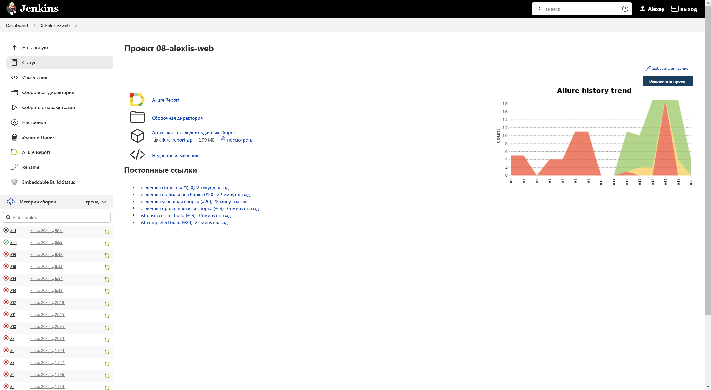
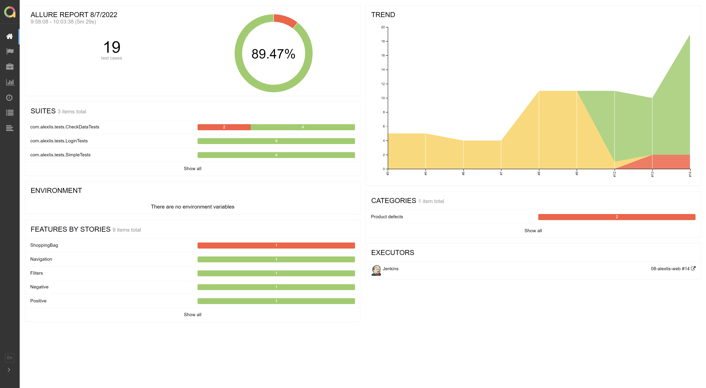
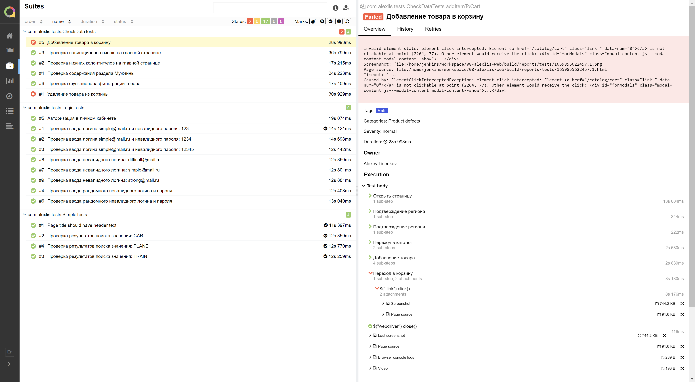
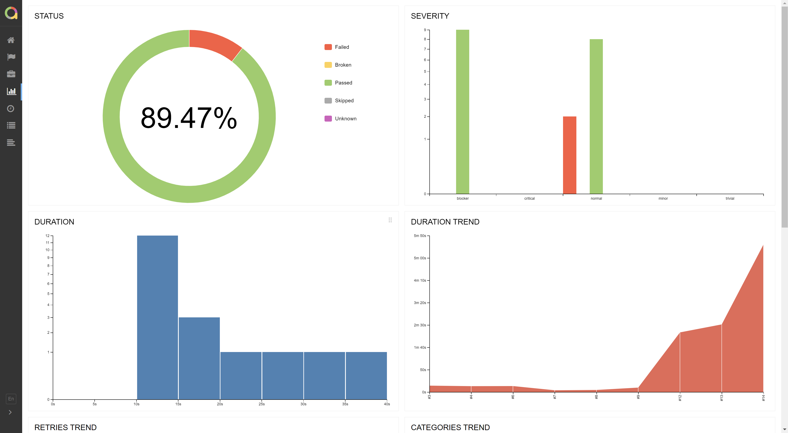
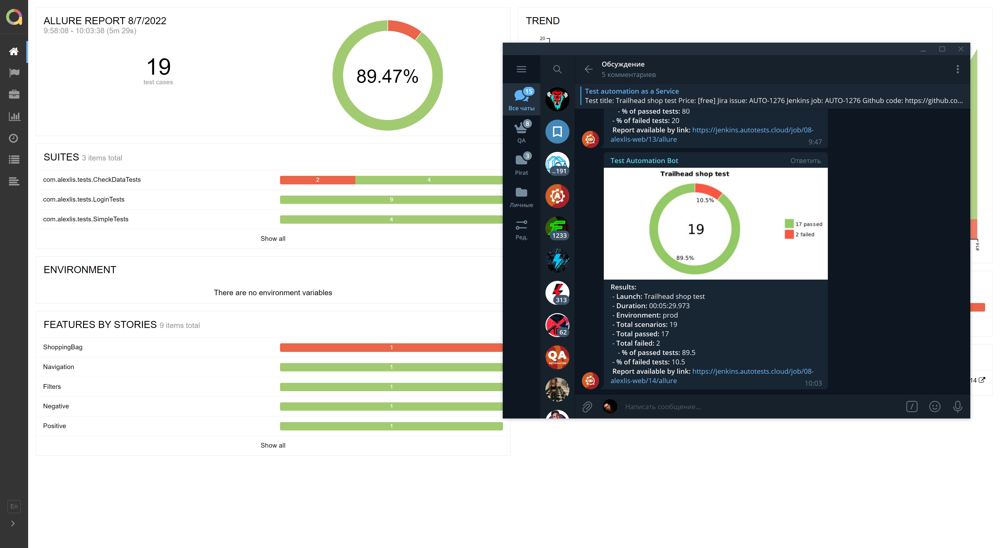

# Проект по автоматизации сайта  [34play](https://www.34play.me/)
**Официальный интернет магазин 34 PLAY**
&nbsp;

&nbsp;

## 🧰: Технологии и инструменты

## 🚀: Реализованные проверки

Набор тест-кейсов функционала авторизации, функционала работы с товарами, добавления их в корзину, а так-же 
проверки основных навигационных элементов страницы. Примеры автоматизированных кейсов:

Тест 1

- ✓ _Переход на сайт 34play_
- ✓ _Нажатие на кнопку "Подтвердить что мне 18"_
- ✓ _Нажатие на кнопку "Подтверждение региона"_
- ✓ _Нажатие на кнопку "Вход"_
- ✓ _Ввод существующего логина_
- ✓ _Ввод валидного пароля для логина_
- ✓ _Проверка валидации введенных данных_

- Тест 2
- ✓ _Переход на сайт 34play_
- ✓ _Нажатие на кнопку "Подтвердить что мне 18"_
- ✓ _Нажатие на кнопку "Подтверждение региона"_
- ✓ _Нажатие на изображение, карточка товара категории толстовки_
- ✓ _Выбор первого в списке экземпляра толстовки_
- ✓ _В модальном окне выбор размер товара_
- ✓ _В модальном окне нажатие кнопки добавления товара в корзину_
- ✓ _Переход в раздел Корзина_
- ✓ _Проверка добавленного товара на наличие и соответствие признаков_

## </a> Jenkins <a target="_blank" href="https://jenkins.autotests.cloud/job/08-alexlis-web/"> job </a>

### 🧙: Параметры сборки в Jenkins:

:yum: Browser (браузер, по умолчанию chrome)

:zany_face: Version (версия браузера, по умолчанию 100.0)

:smirk: Browser_size (размер окна браузера, по умолчанию 3280x2840)

:relieved: URL (выбор url для теста)

:woozy_face: REMOTE_DRIVER_URL (адрес удалённого драйвера)

:cowboy_hat_face: THREADS (выбор количества потоков для запуска)

## 🏗️: Для запуска тестов из терминала необходимо заполнить remote.properties или передать значение:

:one: URL - (выбор url)

:two: BROWSER - (выбор браузера)

:three: BROWSERSIZE - (выбор размера окна браузера)

:four: VERSION - (выбор версии браузера)

:five: REMOTE_DRIVER_URL - (выбор удалённого драйвера)

:seven: ALLURE_NOTIFICATIONS_VERSION - (выбор версии allure)

## </a> Отчет в <a target="_blank" href="https://jenkins.autotests.cloud/job/08-alexlis-web/14/allure/#">Allure report</a>

## ⛅: Overview

## 🧪: Suites

## 💹: Graphs

## </a> Интеграция уведомлений в telegram

## </a> Видео <a target="_blank" href="https://selenoid.autotests.cloud/video/fe43b9f89a795109ff4959044e6650d7.mp4"> прохождения тестов </a>

